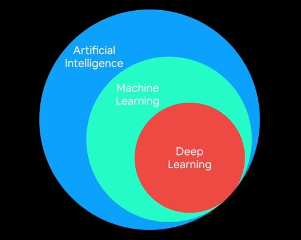
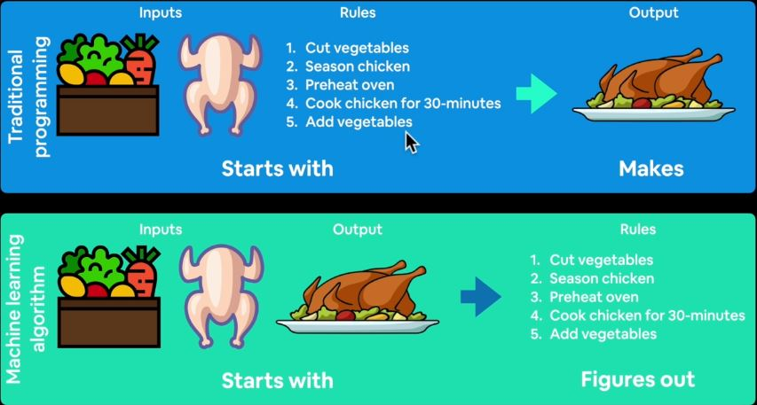

# What is Deep Learning?

Deep Learning is a type of **machine learning** based on artificial neural networks in which multiple layers of processing are used to extract progressively higher level features from data.

## Machine Learning

It is turning things (data) into numbers and finding patterns in those numbers.

### Traditional Programming Vs Machine Learning

|Traditional Programming|ML Algorithm|
|:--------------|---------------:|
|It is hard coded explicitly| The Algorithm figures out the code|

## Why Use Machine Learning (Deep Learning)
For **complex** problem. Imagine, can you hard code a self driving car? It would be difficult to do so for a dynamic environment. So, why not allow machine learning (deep learning) figure it out...

> Machine Learning can be used for literally anything as long as you can convert it to numbers and program it to find patterns. Literally, it could be anything; any output or input from the universe.

### When should you not use Machine Learning
If you can build a **simple rule-based** system that doesn't require machine learning, do that! - Google Machine Learning Handbook.

### What is deep learning good for
- **Problems with long list of rules:** when the traditional approach fails, machine learning/deep learning may help.
- **Continually changing environment:** deep learning can adapt (learn) to new scenerio.
- **Discovering Insight within large collection of data** 

### What is deep learning typically not good for
- **When you need explainability:** the pattern learning by a deep learning models are typically uninterpretable by a human.
- **When traditional approach is a better option**
- **When errors are unacceptable:** since the output of deep learning model aren't always predictable.
- **When you don't have much data:** deep learning models usually require a fairly large amount of data to produce great results.

### Machine Learning Vs Deep Learning
|
Machine Learning
|Deep Learning|
|:--------------:|:------------:|
|Used for structured data|Unstructured data such as natural language text, image recognition, web article, voice recognition.|
|Algorithms: Random Forest, Naive Bayes, Nearest Neigbour, Support Vector Machine etc..These are often referred to as Shallow Algorithm|Algorithms: Neural Networks, Fully Connected Neural Network, CNN, RNN, Transformer.|