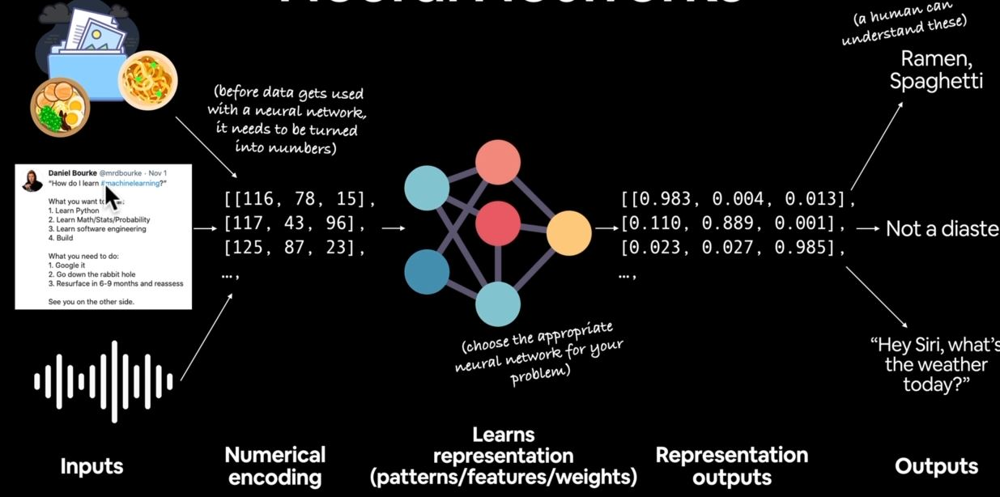
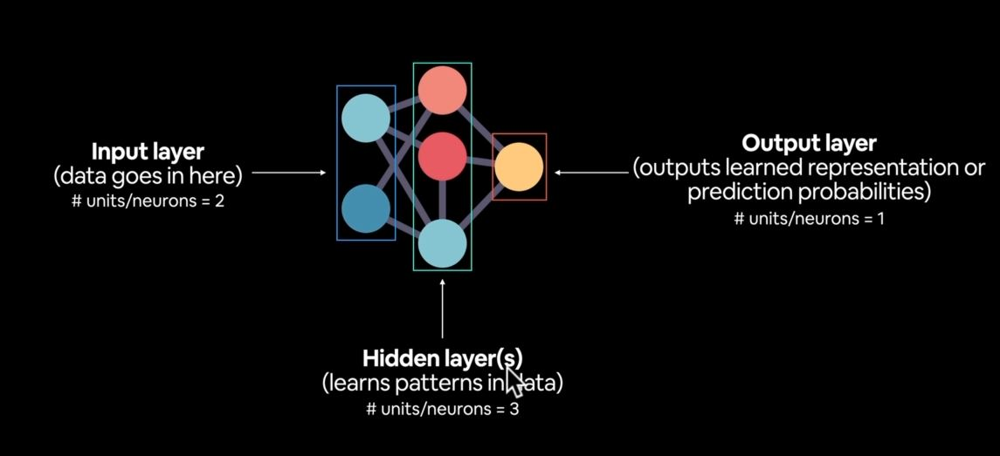

# Neural Networks

A Neural Network is a network or circuits of Neurons, or in modern sense, an artificial neural network, composed of artifical neurons or nodes.

## Anatomy of Neural Networks

1. Input Layer: where the data goes in.
1. Hidden Layers: learn patterns in the data.
3. Output Layer: Output learned representation or prediction probabibilities.

**NOTE:** `Patterns` is an arbitary term, you will often hear `embedding`, `weights`,`feature representation`,`feature vectors` all referring to similiar things. 

## Types of Learning
