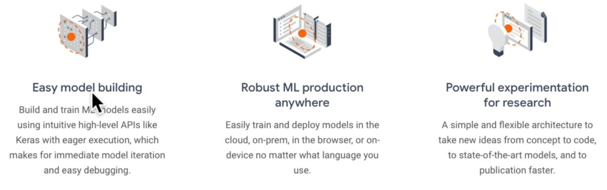
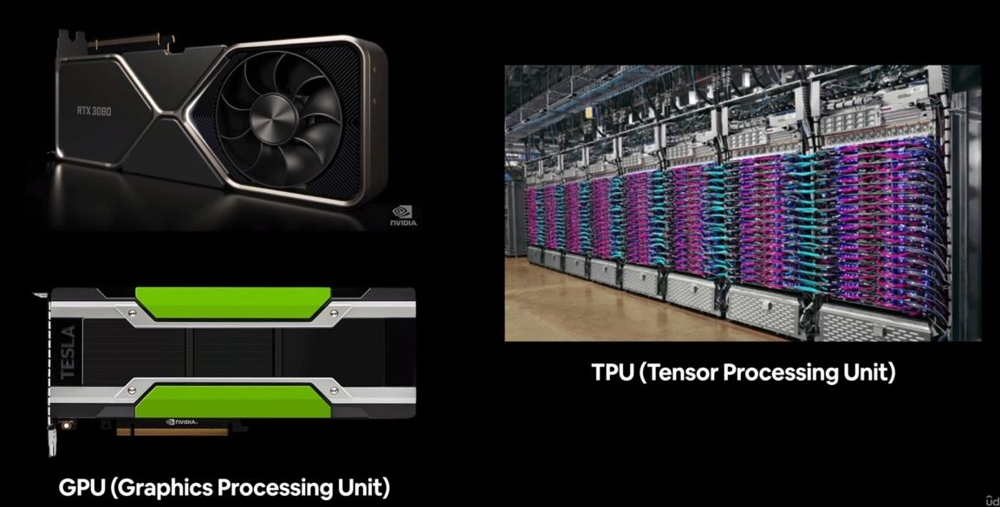

# TensorFlow
- End-to-end machine learning platform.
- Deep learning code in Python/other accessible language able to run on GPU/TPU. (Graphic/Tensor processing unit)
- Able to access many pre-built deep learning models (TensorFlow Hub)
- Whole stack: preprocess data, model data, deploy model in your application.
- Originally designed and used in-house by Google (now open-source).

## Why TensorFlow

## GPU vs TPU

GPU are fast in doing numerical problems and finding patterns from numerical data.

TPU is specifically developed by Google for Neural Network Machine Learning, particularly used in Google's own TensorFlow software.

## What is a Tensor
Tensors are some numerical ways to represent an information or data. They are numerical encoding of information or data.

## TensorFlow Workflow

1. Getting the data ready - turning it to tensor.
2. Build or pick a pretrained model.
3. Fit the model to the data and make prediction.
4. Evaluate the model.
5. Improve through experimentation.
6. Save and reload your trained model.