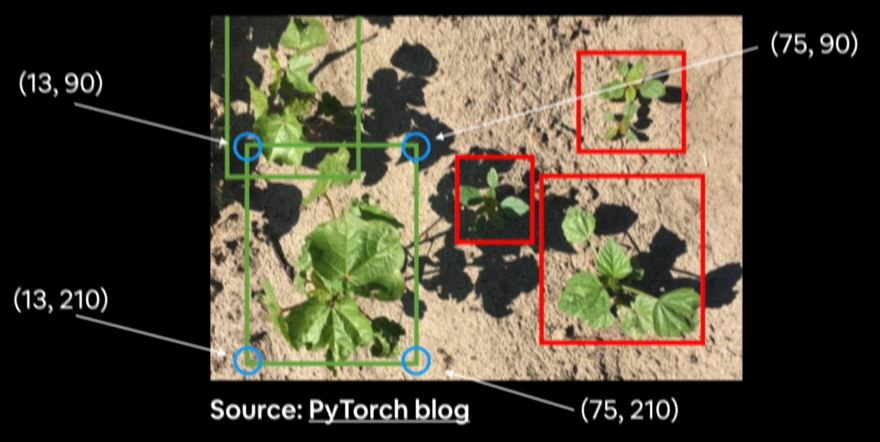
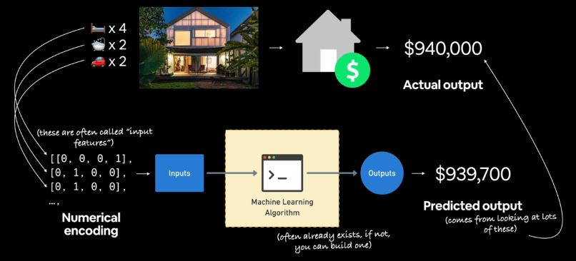
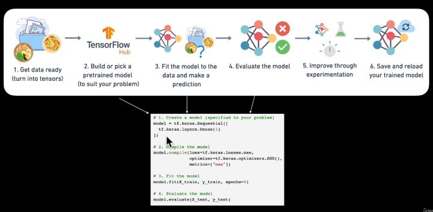

# Neural Network Regression with TensorFlow

## What is Regression Problem?
These are problems trying to predict a continous value (number) such as house price, cost of health insurance and so on.


**N.B:** Notice the word *how much* or *how many*. These are most often pointer of regression problems. Another sort of regression problem is trying to predict the location of bonding box in a classification problem (object detection).



## Course Outline
- Architecture of a neural network regression model
- Input shapes and output shape of a regression model (features and labels)
- Creating custom data to view and fit
- Steps in modelling
    - Creating a model, compiling a model, fitting a model, evaluating a model
- Different evaluation methods

## Regression Inputs and Output



The inputs are features whose shape could be more than one but the output is just a single outcome.

## Architecture of a Neural Network Regression Model

|Hyperparameters| Typical Value|
|:--------------:|:-------------|
|Input layer shape|Same shape as the number of features (e.g **3** for bedrooms, bathroom, and car spaces in housing price prediction)|
|Hidden layer (s)|It is problem specific. min = 1, max = unlimited|
|Neurons per hidden layer|It is problem specific, generally **10 to 100**.|
|Output layer shape|Same shape as desired prediction shape (e.g 1 for house price)|
|Hidden activation|Usually **RELU** (rectified linear unit)|
|Output activation|None, RELU, logistic or tanh|
|Loss function|**MSE** (Mean Square Error) or **MAE** (Mean Absolute Error) or Huber (combination of MAE & MSE) if outliers|
|Optimizer|**SDG** (stochastic gradient descent), **Adam**|

```py
#import the library
import tensorflow as tf

# 1. create a model (specified to your problem)
model = tf.keras.Sequential([
    # input layer -> shape 3 means 3 features (independent variables)
    tf.keras.Input(shape=(3,)),
    # 3 hidden layers with 100 neurons
    tf.keras.layers.Dense(100, activation='relu'),
    tf.keras.layers.Dense(100, activation='relu'),
    tf.keras.layers.Dense(100, activation='relu'),
    # output layer -> 1 means just a target/predicted value with no activation
    tf.keras.layers.Dense(1, activation=None)
])

# 2. compile the model
model.compile(loss=tf.keras.losses.mae, optimizer=tf.keras.optimizers.Adam(lr=0.001),metrics=['mae'])
# loss function -> Mean Absolute Error, Optimizer (how to improve the model to decrease loss) -> Adam, Learning rate (lr) -> 0.001.

# 3. fit the model
model.fit(X_train, y_train, epochs=100)
# epochs -> 100 laps or iterations.
```

**Note:** Fully connected layer is known as <span style="color:red;font-weight:bolder">Dense</span>.

## Steps in modelling with TensorFlow



1. Construct or import a pretrained model relevant to your problem.
2. Compile the model (prepare it to be used with data)
    - **Loss:** how wrong your model predictions are compared to the truth label (you want to minimize this).
    - **Optimizer:** how your model should update its internal patterns to better its predictions.
    - **Metrics:** human interpretable values for how well your model is doing.
3. Fit the model to the training data so it can discover patterns.
    - **Epochs:** how many times the model will go through all the training examples.
4. Evaluating the model on the test data (how reliable are our model's predictions?)

## Improving a model
A model can be improved by altering the steps in creating it. 
1. **Creating a model:** You might:
    - add more layers
    - increase the number of hidden units (neurons)
    - change the activation function of each layer.
2. **Compiling a model:** You might:
    - change the optimization function
    - perhaps change the *learning rate* of optimizer
3. **Fitting a model:** You might:
    - fit a model for more **epochs** (leave it training for longer)
    - give the model more examples to learn from.


**N.B:** 

1. <span style="color:yellow">The learning rate is the most important hyperparameter.</span>
2. When improving model, <span style="color:orange">you experiment, experiment, experiment!!!</span>

## Evaluating a model

Hyperparameters in neural network is like a dial/knob you can tweak. When evaluating a model, <span style="color:magenta">you visualize, visualize, visualize!!!</span>

It is good to visualize:
- **The data:** what data are we working with? What does it look like? `plt.scatter()`
- **The model itself:** what does the model look like? `model.summary()`
- **The training of a model:** how does a model perform while it learns?
- **The prediction of the model:** how do the predictions of a model line up against the ground truth (the original labels)?