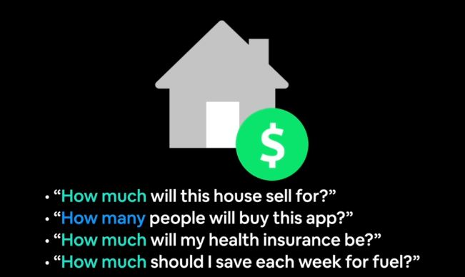

# Neural Network Regression with TensorFlow

## What is Regression Problem?
These are problems trying to predict a continous value (number) such as house price, cost of health insurance and so on.

**N.B:** Notice the word *how much* or *how many*. These are most often pointer of regression problems. Another sort of regression problem is trying to predict the location of bonding box in a classification problem (object detection).

## Course Outline
- Architecture of a neural network regression model
- Input shapes and output shape of a regression model (features and labels)
- Creating custom data to view and fit
- Steps in modelling
    - Creating a model, compiling a model, fitting a model, evaluating a model
- Different evaluation methods

## Regression Inputs and Outputs