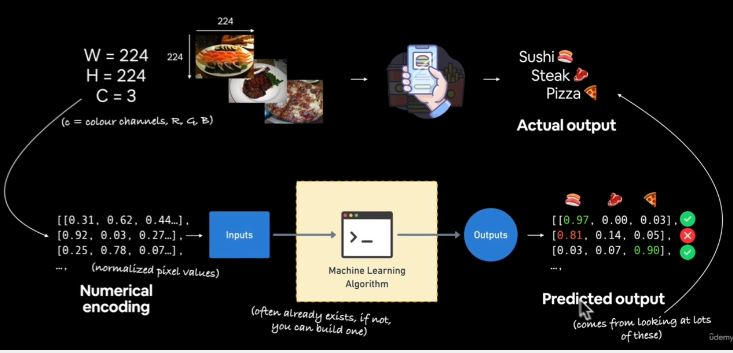
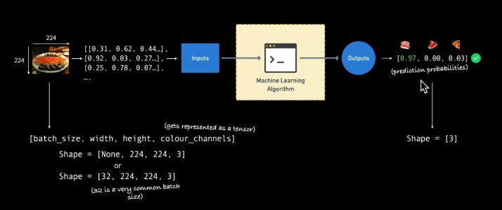

# Neural Network Classification with TensorFlow

## What are classification problems?
Classification problems are:

- **Binary Classification:** "Is this the thing or not" as in, is this email spam or not; is it a boy or a girl e.t.c
- **Multiclass Classification:** more than one thing or another. E.g Different photos of different animals, different photos of people e.t.c 
- **Multilabel Classification:** Multiple label options per sample.

## Course Outlines
- Architecture of Neural Network classification model
- Input shapes and output shapes of a classification model (features and labels)
- Creating custom data to view and fit
- Steps in modelling
    - Creating a model
    - Compiling a model
    - Fitting a model
    - Evaluating a model
- Different classification evaluation methods
- Saving and loading models

## Classification inputs and outputs
Assuming we are building an food app to classify whether a food is pizza, stake, or shawama?
1. The input is different images of the food.
2. Make sure they are all in the same size (height and width).
3. Change the width, height and color channel (RGB) into tensor by numerically encoding it. 
4. Machine learning algorithm or a transfer learning.
5. Output of multiclass or binary classification.



### Input and Output Shapes
- Dimension of the input tensor can be inform of `batch_size`, `width`, `height`, and `colour_channels` 

    ```py
    Shape = [batch_size, width, height, color_channel]
    Shape = [None, 224, 224, 3]

    Shape = [32, 224, 224, 3]
    # 32 is a very common batch size.
    ```
- Output shape is determined by the number of classes. Binary has `2` output as shape while multi class is greater than 2 `>2`.



> The shape varies depending on the problem you're working with.