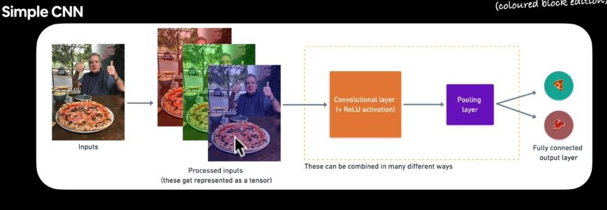
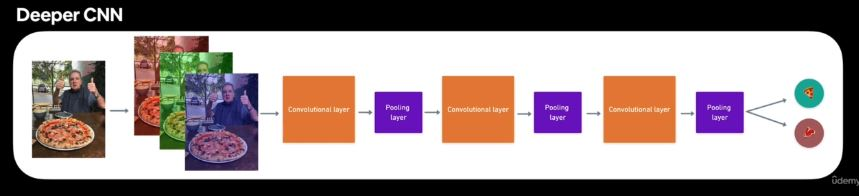

# Convolutional Neural Network and Computer Vision
CNNs can be used for many different computer vision tasks, such as image processing, classification, segmentation, and object detection.

## What is a Computer Vision Problem?
Computer being used for visual problem. Training the computer to see. It applications are: 
- Self driving cars
- Object detection

## What to cover?
- Getting pictorial dataset to work with **pizza & steak** :pizza: 
- Architecture of Convolutional Neural Network (CNN) with TensorFlow.
- An end-to-end binary image classification problem.
- Steps in modelling with CNNs
    - Creating CNN, Compiling a model, Fitting a model, Evaluating a model.
- An end-to-end multi-class image classification problem.
- Making prediction over custom images.

## Computer Vision Input and Output


## Architecture of CNN

```py
# 1. Create a CNN model (name as Tiny VGG)
model.keras.Sequential([
    tf.keras.layer.Conv2D(filters=10, 
        kernel_size=3, # can also be (3,3)
        activation="relu",
        input_shape=(224, 224, 3)),
        # height width, color channel
    tf.keras.layers.Conv2D(10, 3,
        activation="relu"),
    tf.keras.layers.MaxPool2D(pool_size=2
        padding="valid"),
        # pool_size can be (2,2), padding can also be "same"
    tf.keras.layers.Conv2D(10, 3,
        activation="relu"),
    tf.keras.layers.Conv2D(10, 3,
        activation="relu"),
    # activation="relu" == tf.keras.layers.Activation(tf.nn.relu)
    tf.keras.layers.MaxPool2D(2),
    tf.keras.layers.Flatten(),
    tf.keras.layers.Dense(1, activation="sigmoid")
    # binary activation outputs
])

# 2. Compile the model
model.compile(loss="binary_crossentropy", 
    optimizer="adam", metrics=['accuracy'])

# 3. Fit the model
history = model.fit(train_data, epochs=5)
# The train_label (y) got created from the train_data automatically.
```

:key: **Note**

1. **Conv2D:** It stands for convolutional 2D for 2-dimensional data with height and width such as images. It extracts/learns the most important features from the images.
2. **MaxPool2D:** It reduces the dimensionality of the learned image features. The important features learned from Conv is further learned to extract the most important ones.

> There are almost unlimited ways you could stack together a convolutional neural network.

## Hyperparameters and Layer Types

|Hyperparameter/Layer type|What does it do?|Typical Layer|
|:------------:|:--------------------:|:----------:|
|Input image(s)|Target images you'd like to discover patterns in|Whatever you can take a picture (or video) of|
|Input layer|Takes in target images and preproccesses them for further layers|`input_shape = [batch_size, height, width, color_channels]`|
|Convolution layer|Extracts/learns the most important features from target images|Multiple, can create with `tf.keras.layers.ConXD` (X can be multiple values)|
|Hidden activation|Adds non-linearity to learned features (non-straight lines)|Usually `ReLU`|
|Pooling layer|Reduces the dimensionality of learned image features|Average `tf.keras.layers.AvgPool2D` $\\$ or Max `tf.keras.layer.MaxPool2D`|
|Fully connected layer|Further refines learned features from convolution layers|`tf.keras.layers.Dense`|
|Output layer|Takes learned features and outputs them in shape of target labels|`output_shape = [number_of_classes]` e.g 3 for pizza, steak, sushi|
|Output activation|Adds non-linearities to output layer|`sigmoid` for binary classification $\\$ `softmax` for multiclass classification|





## End-to-end Example
For end-to-end CNN, the following are the step:
- Load our images
- Preprocess our images
- Build CNN to find patterns
- Compile our CNN
- Fit the CNN model to data

**Sample code for loading and preprocessing**

```py
import tensorflow as tf
from tf.keras.preprocessing.image import ImageDataGenerator

tf.random.set_seed(42)

# Preprocess the data
train_datagen = ImageDataGenerator(rescale=1./255)
test_datagen = ImageDataGenerator(rescale=1./255)

# Set path to the data directory
train_dir = "../path/to/thedata"
test_dir = "../path/to/testdata"

# Import data from directories and turn it into batches
train_data = train_datagen.flow_from_directory(directory=train_dir, batch_size=32, target_size=(224,224), class_mode="binary", seed=42)

valid_data = valid_datagen.flow_from_directory(directory=test_dir, batch_size=32, target_size=(224, 224), class_mode="binary", seed=42)
```

**ImageDataGenerator:** Generate batches of tensor image data with real-time data augmentation.

**Flow_from_directory:** Takes the path to a directory & generates batches of augmented data.

```py
# Build a CNN model (same as the Tiny VGG on the CNN explainer website)
model_1 = tf.keras.Sequential([
    # VGG -> Notice 2 Conv2D and 1 MaxPooling2D
    tf.keras.layers.Conv2D(filters=10, kernel_size=3, activation='relu', input_shape=(224, 224, 3)),
    tf.keras.layers.Conv2D(10, 3, activation='relu'),
    tf.keras.layers.MaxPooling2D(pool_size=2, padding="valid"),
    tf.keras.layers.Conv2D(10, 3, activation="relu"),
    tf.keras.layers.Conv2D(10, 3, activation="relu"),
    tf.keras.layers.MaxPooling2D(2),
    # Flatten the images before the output layer
    tf.keras.layers.Flatten(),
    tf.keras.layers.Dense(1, activation="sigmoid")
])

# Compile the model
model_1.compile(loss="binary_crossentropy", optimizer="adam", metrics=['accuracy'])

# Fit the model
history_1 = model_1.fit(train_data, epochs=5, steps_per_epoch=len(train_data), validation_data=valid_data, validation_steps=len(valid_data))
```

## Non CNN model on image data

Creating a model to replicate the Tensorflow Playground model will work; but, the model will not perform well. It may be guessing (i.e) ~ 50% model or validation accuracy. 

You can add extra hidden layers and increase the neurons. This would help the model to have more trainable params, thereby increasing the accuracy of the model. Nonetheless, CNN is still better than non CNN model fitted with image data.

> You can think of trainable parameters as **patterns a model can learn from data.** Intuitively, you might think more is better. And in lots of cases, it is. But in this cases, the difference here is the two different styles of model we're using. Where a series of dense layers has a number of different learnable parameters connected to each other and hence a higher number of possible learnable patterns, **a convolutional neural network seeks to sort out and learn the most important patterns is an image**. So, even though there are less learnable parameters in out convolutional neural network, these are often more helpful in deciphering between different **features** in an image.

## Binary Classification Explanation
The Step are as follows:

- Get familiar to the data
- Preprocess the data
    - The data are turn into **batches**. A batch is a small subset of data. And it is done for the following reason:
    - 10,000 images (or more) might not fit into the memory of the processor.
    - Trying to learn the patterns in 10,000 images in one hit could result in the model not being able to learn very well.
    - Why **32 batches**? Recommended by `Yann LeCun` founder of CNN, Professor at NYU, chief AI Scientist at Facebook.
```py
# Create train and test data generators and rescale the data
from tensorflow.keras.preprocessing.image import ImageDataGenerator

train_datagen = ImageDataGenerator(rescale=1./255)
test_datagen = ImageDataGenerator(rescale=1./255)
```
**ImageDataGenerator:** It is a way of loading data. Once the images are loaded, they are rescaled by dividing by 255.
- Create a CNN model