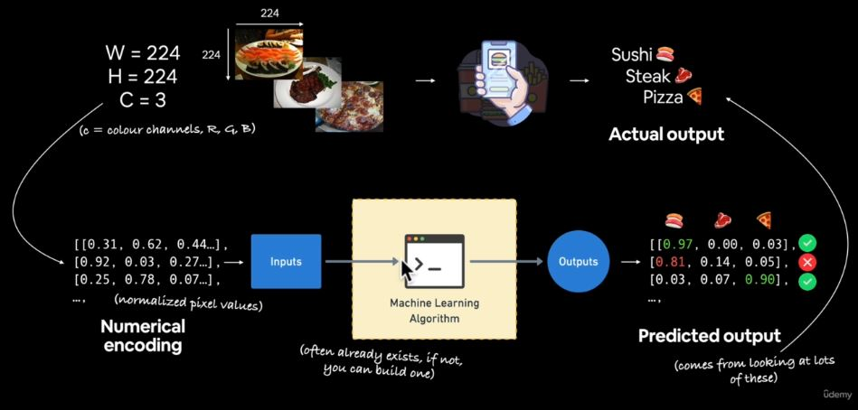

# Convolutional Neural Network and Computer Vision

## What is a Computer Vision Problem?
Computer being used for visual problem. Training the computer to see. It applications are: 
- Self driving cars
- Object detection

## What to cover?
- Getting pictorial dataset to work with **pizza & steak** :pizza: 
- Architecture of Convolutional Neural Network (CNN) with TensorFlow.
- An end-to-end binary image classification problem.
- Steps in modelling with CNNs
    - Creating CNN, Compiling a model, Fitting a model, Evaluating a model.
- An end-to-end multi-class image classification problem.
- Making prediction over custom images.

## Computer Vision Input and Output


## Architecture of CNN

```py
# 1. Create a CNN model (name as Tiny VGG)
model.keras.Sequential([
    tf.keras.layer.Conv2D(filters=10, 
        kernel_size=3, # can also be (3,3)
        activation="relu",
        input_shape=(224, 224, 3)),
        # height width, color channel
    tf.keras.layers.Conv2D(10, 3,
        activation="relu"),
    tf.keras.layers.MaxPool2D(pool_size=2
        padding="valid"),
        # pool_size can be (2,2), padding can also be "same"
    tf.keras.layers.Conv2D(10, 3,
        activation="relu"),
    tf.keras.layers.Conv2D(10, 3,
        activation="relu"),
    # activation="relu" == tf.keras.layers.Activation(tf.nn.relu)
    tf.keras.layers.MaxPool2D(2),
    tf.keras.layers.Flatten(),
    tf.keras.layers.Dense(1, activation="sigmoid")
    # binary activation outputs
])

# 2. Compile the model
model.compile(loss="binary_crossentropy", 
    optimizer="adam", metrics=['accuracy'])

# 3. Fit the model
history = model.fit(train_data, train_labels, 
                    epochs=5)
```

:key: **Note**

1. **Conv2D:** It stands for convolutional 2D for 2-dimensional data with height and width such as images. It extracts/learns the most important features from the images.
2. **MaxPool2D:** It reduces the dimensionality of the learned image features. The important features learned from Conv is further learned to extract the most important ones.

> There are almost unlimited ways you could stack together a convolutional neural network.

|Hyperparameter/Layer type|What does it do?|Typical Layer|
|:------------:|:--------------------:|:----------:|
|Input image(s)|Target images you'd like to discover patterns in|Whatever you can take a picture (or video) of|
|Input layer|Takes in target images and preproccesses them for further layers|`input_shape = [batch_size, height, width, color_channels]`|
|Convolution layer|Extracts/learns the most important features from target images|Multiple, can create with `tf.keras.layers.ConXD` (X can be multiple values)|
|Hidden activation|Adds non-linearity to learned features (non-straight lines)|Usually `ReLU`|
|Pooling layer|Reduces the dimensionality of learned image features|Average `tf.keras.layers.AvgPool2D` $\\$ or Max `tf.keras.layer.MaxPool2D`|
|Fully connected layer|Further refines learned features from convolution layers|`tf.keras.layers.Dense`|
|Output layer|Takes learned features and outputs them in shape of target labels|`output_shape = [number_of_classes]` e.g 3 for pizza, steak, sushi|
|Output activation|Adds non-linearities to output layer|`sigmoid` for binary classification $\\$ `softmax` for multiclass classification|


